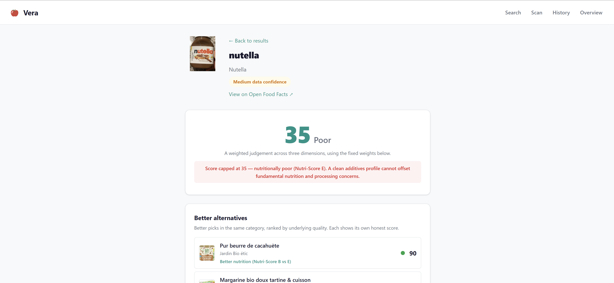
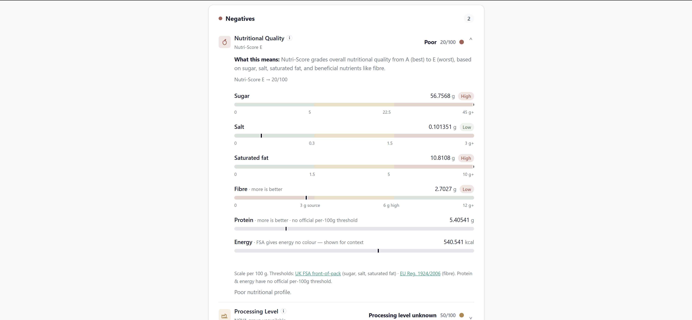
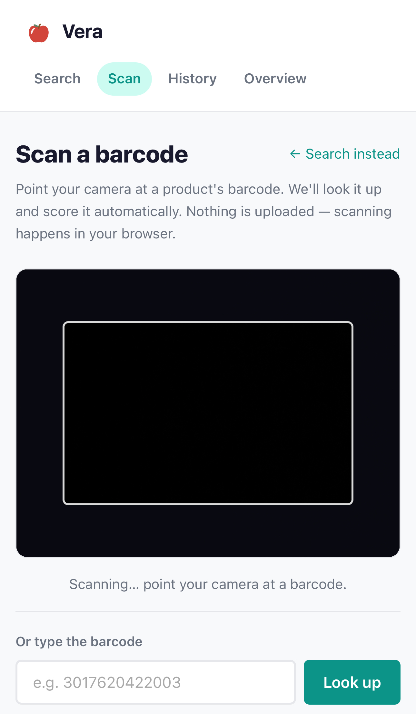

# Vera

**The truth about what's in your food.**

Vera scores the healthiness and safety of food products — but unlike the popular scanner apps that hand you a single number with no explanation, Vera shows you exactly *why* a product scores the way it does, puts the evidence behind every flagged ingredient in front of you, and tells you how much to trust the data.

Search a product by name or scan its barcode, and you get a transparent, evidence-based breakdown instead of a verdict you're expected to take on faith.

---

## Screenshots

| Product score | Per-nutrient transparency bars | Barcode scan |
|---|---|---|
|  |  |  |

---

## The problem

Apps like Yuka made food scoring mainstream, but they share a set of well-documented flaws:

| Typical scanner (e.g. Yuka) | Vera |
|---|---|
| One opaque number, no breakdown | Three visible dimensions, each scored separately |
| Hidden weighting you can't inspect | Weights shown as percentages, with the reasoning for each |
| Flags additives with no evidence | Every flagged additive shows the science, dose/context, and a source link |
| No signal when the data is thin | Confidence badge (High / Medium / Low) explaining what's missing |
| No link back to the source | Direct link to the Open Food Facts product page |
| Tells you what's bad, not what's better | Recommends better alternatives in the same category, with an honest reason |

Vera is built around one principle: **a food score is only useful if you can see how it was reached.**

---

## What it does

- **Transparent scoring across three dimensions** — Nutrition, Additives, and Processing Level, each scored 0–100 and combined into a single overall score.
- **Plain-language labels with "what this means"** — each dimension leads with an everyday classification (e.g. "Excellent", "Poor", "Ultra-processed") rather than jargon, with the technical term kept alongside and a one-line explanation of what the metric actually measures, surfaced behind an info icon and in the expanded detail.
- **Per-nutrient transparency bars** — inside the Nutritional Quality detail, sugar, salt, saturated fat, fibre, protein, and energy are shown per 100 g (per 100 ml for drinks) on sourced low→high scales. Sugar, salt, and saturated fat use the UK FSA front-of-pack thresholds — with separate food and drink columns — fibre uses the EU nutrition-claim thresholds, and protein and energy are shown neutrally where no official threshold exists. A nutrient with a reported value of zero reads "0 g"; one Open Food Facts has no value for reads "Not provided" — the two are never conflated. The bars are a read-only transparency layer beneath the Nutri-Score and never change the score. It's a deliberate step beyond apps like Yuka, whose nutrient thresholds aren't disclosed.
- **Negatives / Positives breakdown** — every factor is grouped into what's hurting the score and what's helping it, each row expandable to show the detail.
- **Per-additive evidence cards** — each E-number is looked up in a curated database and shown with an evidence summary, dose/context note, and a source link (primarily EFSA opinions and peer-reviewed studies) — so you can read the reasoning, not just accept the flag.
- **Better-alternatives recommendations** — for any product, Vera finds higher-quality options in the same category and tells you *why* each is better ("Better nutrition (Nutri-Score B vs D)", "Less processed (NOVA 2 vs 4)", "Cleaner additives") — and never recommends a product whose data is incomplete.
- **Barcode scanning** — point your camera at a barcode and Vera looks it up automatically. Scanning runs entirely in your browser; nothing is uploaded. There's a manual entry fallback when a camera isn't available.
- **Scan history and overview** — your recently scored products and an at-a-glance summary, stored locally in your browser. No accounts, no tracking.
- **Honest about uncertainty** — when Open Food Facts is missing Nutri-Score or NOVA data, the confidence badge drops and explains exactly what's missing. The score is still shown; you just know how far to trust it.

---

## How scoring works

Every product is scored across three dimensions. Each is scored 0–100, and the overall score is their **fixed** weighted sum.

### 1. Nutritional Quality — 50%
Derived from the product's **Nutri-Score grade** (A–E), mapped to a 0–100 scale. The mapping is a deliberate v1 simplification, documented in [`app/scoring/tables.py`](app/scoring/tables.py).

| Nutri-Score | Score |
|---|---|
| A | 100 |
| B | 80 |
| C | 60 |
| D | 40 |
| E | 20 |

### 2. Additives — 30%
Each E-number is looked up in a hybrid database: a baseline of 40 common additives from the Open Food Facts taxonomy, enriched with a hand-curated set of 86 entries carrying evidence summaries, dose/context notes, and source links. High-risk additives deduct 30 points each; moderate-risk deduct 10. Every flag becomes an expandable evidence card.

### 3. Processing Level — 20%
Derived from the product's **NOVA group** (1–4), which classifies how industrially processed a food is.

| NOVA group | Score |
|---|---|
| 1 — Unprocessed | 100 |
| 2 — Culinary ingredients | 75 |
| 3 — Processed | 40 |
| 4 — Ultra-processed | 0 |

### Why the weights are fixed

Earlier versions let you drag sliders to re-weight the dimensions live. **I removed that deliberately.** Adjustable weights let anyone dial a product up to a flattering number, which quietly destroys the one thing a score is for — being a consistent, comparable judgement. The weights are now fixed and shown on every score page with the reasoning behind each: nutrient profile has the most direct, best-established link to long-term health, so it carries the most weight; additives reflect a precautionary read of the evidence; ultra-processing matters but less directly than core nutrient content.

### The integrity cap

A clean additives profile shouldn't be able to rescue a fundamentally poor product. So when a product is **ultra-processed (NOVA 4)** or **nutritionally very poor**, the overall score is capped (at 35) regardless of how good its other dimensions look — and the score page says why. The cap is computed alongside the raw weighted score, so alternative ranking can still compare products *within* a category fairly.

---

## Architecture

- **Server-rendered HTML** via Jinja2. The full score result is serialised into the page, so the product score works with **no JavaScript at all** — JS only enhances (barcode scanning, client-side history).
- **Pluggable scoring engine.** Each dimension is an independent scorer behind a Python `Protocol`, wired together by `FoodScoringEngine`. Adding a cosmetics scorer later means writing one new engine class — no changes to routes, templates, or JS.
- **Thin async OFF client** with TTL caching, bounded-concurrency category fetches, and graceful degradation on every failure mode (rate limit, 5xx, not found, timeout). A failing alternatives lookup can never break the score page.

```
app/
  main.py            FastAPI routes + app factory
  config.py          pydantic-settings configuration
  models.py          dataclasses + enums
  off_client.py      Open Food Facts client (search, fetch, normalise, cache, retry)
  additive_db.py     merges OFF taxonomy + curated evidence at startup
  alternatives.py    same-category better-alternative recommendations
  nutrition_bars.py  per-nutrient transparency bars (FSA / EU thresholds)
  presentation.py    groups factors into Negatives / Positives rows
  scoring/           NutritionScorer, AdditiveScorer, NovaScorer, FoodScoringEngine
data/                additive taxonomy (JSON) + curated evidence (YAML)
templates/           Jinja2 templates
static/              hand-written CSS + vanilla-JS modules (scan, history)
tests/               pytest suite + JS unit tests
```

---

## Tech stack

- **Backend:** Python 3.12, FastAPI
- **Templates:** Jinja2 (server-rendered; the score page works without JavaScript)
- **Frontend:** Vanilla JS as ES modules — no framework, no build step
- **Barcode scanning:** [ZXing](https://github.com/zxing-js/browser) loaded from CDN with Subresource Integrity and a graceful fallback
- **Data:** [Open Food Facts](https://world.openfoodfacts.org/) — search-a-licious search API + Product v2 API
- **Styling:** hand-written CSS, no framework
- **Deployment:** Docker / docker-compose, with a Render Blueprint (`render.yaml`)

---

## Engineering notes

A few problems that were more interesting than they first looked:

- **The search API moved out from under the app.** Open Food Facts permanently deprecated the legacy `/cgi/search.pl` endpoint (it now returns 503). Search was migrated to the newer [search-a-licious](https://search.openfoodfacts.org/) service, which has a different response shape and ranking model — category lookups now sort by popularity for a stable, recognisable candidate set.
- **Rate limiting on popular products.** Fetching a whole pool of alternative candidates at once burst-trips the OFF rate limit (429). The fix is two-fold: bounded-concurrency fetches (a small ceiling instead of firing everything at once) and exponential-backoff retry on 429. Candidates are also pre-ranked from cheap search fields, so only products that could *plausibly* beat the current score are fetched in full.
- **TLS that works everywhere.** On dev machines behind a TLS-intercepting proxy or antivirus, the default CA bundle rejects the OFF connection; on a minimal Linux production host, the OS trust store may be unavailable. The client prefers the OS trust store via `truststore` and falls back to certifi's bundle, so the connection works in both environments without configuration.
- **Additive de-duplication.** OFF tags additives with Roman-numeral subtypes (`e322i`, `e322ii`) that are the same additive for scoring purposes, while single-letter suffixes (`e160a`, `e160b`) are genuinely distinct. The normaliser collapses the former and keeps the latter.

---

## Running locally

**Prerequisites:** Python 3.12+

```bash
# 1. Clone and enter the project
git clone https://github.com/Churmann/Vera.git
cd Vera

# 2. Install dependencies
pip install -r requirements.txt

# 3. Start the server
uvicorn app.main:app --port 8000
```

Open `http://localhost:8000` and search for any food product by name, or use the **Scan** page to scan a barcode.

> **Note on scanning:** browsers only allow camera access over a secure context (HTTPS or `localhost`), so the camera works on `localhost` in development and over HTTPS in production. The manual barcode-entry fallback works everywhere.

**With Docker:**

```bash
docker-compose up
```

**Configuration** is optional — the defaults work out of the box. To customise, copy `.env.example` to `.env`:

```
OFF_USER_AGENT=VeraApp/1.0 (your@email.com)
OFF_REQUEST_TIMEOUT=8
OFF_CACHE_TTL=300
```

---

## Tests

```bash
pytest                  # 208 Python tests
node --test tests/js/   # JavaScript unit tests (no extra dependencies)
```

The Python suite covers the scoring engine, additives database, Open Food Facts client (search, fetch, normalisation, caching, retry), alternatives logic, and every route. The JS tests cover the pure helpers in the barcode-scanning and history modules.

---

## Data sources and licence

Product data is fetched from [Open Food Facts](https://world.openfoodfacts.org/), available under the [Open Database Licence (ODbL)](https://opendatacommons.org/licenses/odbl/); individual contents are under the [Database Contents Licence (DbCL)](https://opendatacommons.org/licenses/dbcl/).

Additive evidence summaries are drawn from EFSA opinions, IARC monographs, and peer-reviewed literature, with source links shown on each evidence card.

Scores are informational only and are not medical or dietary advice.

This project's own code is released under the [MIT License](LICENSE).
